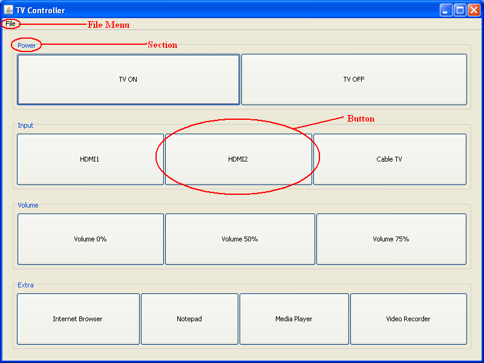
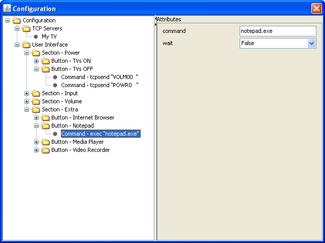

**MasterControl Documentation**

MasterControl is a program that facilitates sending TCP commands to
other devices, the execution of other programs, and the sending of
keystrokes to the system. This is presented to the user as a series of
button groups for easy execution.

**Requirements**

Java Virtual Machine

Jaxen Xpath library for Java (Included)

**Compiling MasterControl**

Compilation of the application requires Apache Ant. Build and run the application with the following command:

`ant build`

To view other options, just run:

`ant`

**Usage**

Use Java to execute the file MasterControl.jar:

`java -jar MasterControl.jar`

**User Interface**

Below is a screen capture that details the primary portion of the user
interface:

The sections and the buttons within them can be customized from
“File-&gt;Modify Configuration” menu.

**Configuration**

Choosing the “File-&gt;Modify Configuration” menu item displays a screen
that can be used to configure the appearance of the primary portion of
the user interface. Below is the configuration screen for the example in
the previous screen capture:

**Configuration Nodes**

The configuration is displayed in a tree view on the left pane of the
window (called the “Configuration pane”) comprised of items called
nodes. Each node may or may not have child nodes. For example, the root
node, labeled “Configuration”, has two child nodes labeled “TCP Clients”
and “User Interface”. On the other hand, the selected node, labeled
“Command – exec ‘notepad.exe’” has no child nodes. The configuration
structure can be altered by adding, reordering, and removing nodes.
Right clicking on a node causes a context menu to popup, having these
three options:

-   Add Child – Adds a child node to the selected node. The new child will be the last node of all selected node’s children. For example, if the node “Button – Notepad” was currently selected, the new child would appear after the node, “Command – exec ‘notepad.exe’”.

-   Add Sibling – Adds a child node to the parent node of the selected node. The new child will appear after the selected node. For example, if the node “Button – Notepad” was currently selected, a new node would appear before the node “Button – Media Player” as a child of the node “Section – Extra”.

-   Remove Item – Removes the current node from the tree. Some nodes cannot be removed.

Nodes can be rearranged, as long as they will still have the same parent.
To move a node, left click on the node and drag it to its new position.
When the mouse button is released, the node will be moved.

**Node Attributes**

Each node may or may not have attributes. When a node is selected, its
attributes are displayed in the right pane of the window (called the
“Attributes pane”). They can be altered by typing in or selecting a new
value. The changes will be saved and reflected once the Configuration
screen has been closed. Attributes cannot be added or removed.

**Configuration Management**

To create a new configuration, select “New Configuration” from the File
menu. Configurations can be loaded and saved using the “Load
Configuration” and “Save Configuration As…” File menu items
respectively.

The configuration file used by Master Control when it first starts can
be specified on the command line using the following format:

java –jar MasterControl.jar YourConfigFileHere.dat

where “YourConfigFileHere.dat” is the name of the configuration file you
wish to use. If a configuration file is not specified, the default
configuration file “settings.dat” is used.

**Configuration Format**

For information on the MasterControl Configuration Format can be viewed [here](http://htmlpreview.github.io/?https://github.com/aphillip/MasterControl/blob/master/MasterControlConfigurationFormat.html).

**TCPCommunicator**

TCPCommunicator is a java class that can act as a TCP server and a TCP client.  It can be used as a dummy server for MasterControl’s tcpsend command.  It is located in the src/test folder and can be compiled with javac. Run `java TCPCommunicator` for usage instructions.
